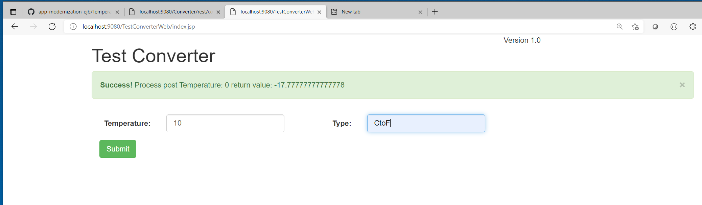

# legacy-was
Directory which contains all the legacy java code to run on Websphere Application Server v8.5.5 on java 1.6

# For the old people in the room. 
Start up the old WAS on you Windows desktop 
```
start First steps from you desktop tool box
```
 

Started the SERVER by default **AppSrv01**

 
 
You see in the window > Applications > Application Types > WebSphere enterprise applications
we have **ConverterService war** and **TempEAR** running

 

For test purpose in the TempEAR I have a small frontend running and calling the ejb local bean ConverterBean

 
