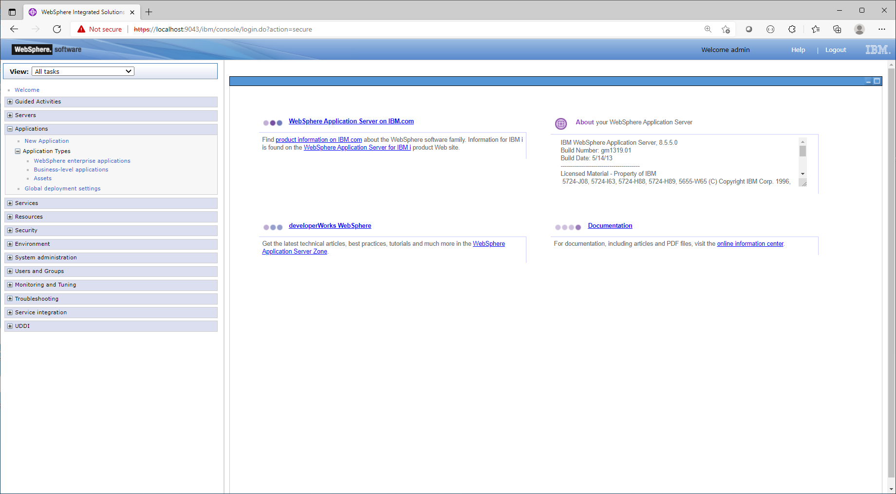

# legacy-was
Directory which contains all the legacy java code to run on Websphere Application Server v8.5.5 on java 1.6

# For this we have old eclipse project in a workspace
* TempEAR
* TempEJB
* TempEJBClient
* TestConverterWeb
* ConverterService

On my machine I create the workspace *eclipse-workspace-temp*
This is also base on the chapter on EJB [IBM Red book](http://www.redbooks.ibm.com/redbooks/pdfs/sg248076.pdf)


# For the old people in the room. 
Start up the old WAS on you Windows desktop 
```
start First steps from you desktop tool box
```
 

Started the SERVER by default **AppSrv01**

 
 
You see in the window > Applications > Application Types > WebSphere enterprise applications
we have **ConverterService war** and **TempEAR** running

 

For test purpose in the TempEAR I have a small frontend running and calling the ejb local bean ConverterBean

Simple servlet accessing the local EJB with annotation - This is the java project **TestConverterWeb**
```
@WebServlet( urlPatterns = "/TestServlet", loadOnStartup=1)
public class TestServlet extends HttpServlet {
	
	private static final long serialVersionUID = 1L;
	
	private static final Logger LOGGER = Logger.getLogger(TestServlet.class.getName());
	   
	
    @EJB 
    ConverterLocal local;
     ...
```

 
 
 
We have the ConverterService.war application which call the REMOTE EJB ConverterBean. This Service contains 6 methods 

* CtoF - Celsius to Farenheit
* CtoK - Celsius to Kelvin
* FtoC - Farenheith to Celsius
* FtoK - Farenheith to Kelvin
* KtoC - Kelvin to Celsius
* KtoF - Kelvin to Farenheith

```
private ConverterRemote lookupEJB(Temperature temp) {
		Context ctx;
		
		try {
			Properties props = new Properties();
			props.setProperty(Context.INITIAL_CONTEXT_FACTORY, "com.ibm.websphere.naming.WsnInitialContextFactory");
			props.setProperty(Context.PROVIDER_URL, "corbaloc:iiop:DESKTOP-JR1BRQA:2809");
			
			ctx = new InitialContext(props);
			
			Object homeObject = ctx.lookup("ejb/ConverterRemote");
			ConverterRemote myRemoteEJB = (ConverterRemote) PortableRemoteObject.narrow(homeObject, ConverterRemote.class);

			return myRemoteEJB;
			
		} catch (NamingException ex) {
			System.out.println("Error with Remote EJB: " + ex.getMessage());
			temp.setMessage("Error: " + ex.getMessage());
		}
		return null;
```

 
