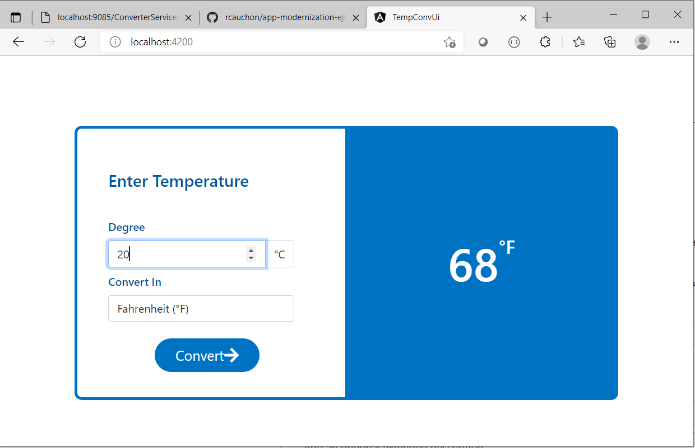

# modernize-liberty
Code repository with NEW code running on Websphere Liberty profile server v21.0.0.9 

## First Step
Convert all legacy eclipse legacy project to maven project 

I also added a pom.xml in the parent directory modernize-liberty
```
 <modules>
    <module>TempEJBClient</module>
    <module>TempEJB</module>
    <module>TempEAR</module>
    <module>ConverterService</module>
 </modules>
```

To compile the project you can run `make clean install` from the parent directory

Prerequisite are Maven, JAVA 1.8 jdk and liberty install on you computer in some of the pom.xml there is an hardcoded path for liberty 
```
  <installDirectory>/dev/wlp2021</installDirectory>
```
in the TempEAR/pom.xml and in the ConverterService/pom.xml

If all the above goes well you can start both application in 2 separate liberty server
```
cd TempEAR
mvn liberty:run

cd ConverterService
mvn liberty:run
```

This will start 2 liberty servers named **ejbServer** and **ejbclient** 
We added 2 variables on the server.xml file of the ejbServer define in the server.env file
```
ejb_server_hostname=localhost
ejb_server_iiop_port=22809
```
used in the server.xml
```
<iiopEndpoint host="${ejb_server_hostname}" id="defaultIiopEndpoint" iiopPort="${ejb_server_iiop_port}">
		<!-- the following option has to be removed to allow remote ejb calls without ssl 
			<iiopsOptions iiopsPort="22810" sslRef="mySSLConfiguration" suppressHandshakeErrors="false"/> -->
</iiopEndpoint>`

```

We added 4 variables on the server.xml file of the ejbClient define in the server.env file
```
ejb_server_hostname=localhost
ejb_server_iiop_port=22809
ejb_server_remote_path=TempEAR-0.0.1/com.ibm.temp-TempEJB-0.0.1/ConverterBean
ejb_server_remote_bean=com.ibm.temp.ejb.ConverterRemote
```
used in the JSONController.java code from the project ConverterService
```
		try {

			Context ctx = new InitialContext();
			
			String hostname = System.getenv("ejb_server_hostname");
            System.out.println("EJB Server Hostname: "+ hostname);
			String port = System.getenv("ejb_server_iiop_port");
			System.out.println("EJB Server iiop port: "+ port);

			String ejbRemotePath = System.getenv("ejb_server_remote_path");
			System.out.println("EJB Server remote path: "+ ejbRemotePath);
			String ejbRemoteBean = System.getenv("ejb_server_remote_bean");
			System.out.println("EJB Server remote bean: "+ ejbRemoteBean);

			if (hostname == null || hostname.isEmpty()){
				hostname = "localhost";
			}
			if (port == null || port.isEmpty()){
				port = "22809";
			}

            String provider = "corbaname::" + hostname + ":" + port;
			                
			// ejb_server_remote_path=TempEAR-0.0.1/com.ibm.temp-TempEJB-0.0.1/ConverterBean
            // ejb_server_remote_bean=com.ibm.temp.ejb.ConverterRemote
			String ejbGlobalStr = "ejb/global/" + ejbRemotePath + "!" + ejbRemoteBean;

			Object homeObject = ctx.lookup(provider + "#" + ejbGlobalStr);
			ConverterRemote myRemoteEJB = (ConverterRemote) PortableRemoteObject.narrow(homeObject, ConverterRemote.class);

			return myRemoteEJB;
			
		} catch (NamingException ex) {
			System.out.println("Error with Remote EJB: " + ex.getMessage());
			temp.setMessage("Error: " + ex.getMessage());
		}
		return null;
```

Accessing the Converter Rest API is the same as describe below since we are using the same port as the docker container .
Type this URL in your browser or curl
```
http://localhost:9085/ConverterService/rest/converter/CtoF/25
```

From the above document you should have a running applications ejbServer and ejbClient,
```
ctrl-c  on both terminal where you started the 2 servers 
```

Now you are ready to go to step 2 - Doing this again with Docker image and container

## Second Step running with Docker

To run the ebj server and client under docker

Build the image EJB server change directory to TempEAR
```
cd TempEAR
docker build --tag ejb-server .
```
Snippet code of the command 
```
docker inspect ejb-server
"ExposedPorts": {
                "9080/tcp": {},
                "9082/tcp": {},
                "9442/tcp": {},
                "9443/tcp": {}
            },
            
            ...
             "Env": [
                "PATH=/opt/ol/wlp/bin:/opt/ol/docker/:/opt/ol/helpers/build:/opt/java/openjdk/bin:/usr/local/sbin:/usr/local/bin:/usr/sbin:/usr/bin:/sbin:/bin",
                "container=oci",
                "LANG=en_US.UTF-8",
                "LANGUAGE=en_US:en",
                "LC_ALL=en_US.UTF-8",
                "JAVA_VERSION=jdk8u302-b08_openj9-0.27.0",
                "JAVA_HOME=/opt/java/openjdk",
                "JAVA_TOOL_OPTIONS=-XX:+IgnoreUnrecognizedVMOptions -XX:+IdleTuningGcOnIdle -Xshareclasses:name=openj9_system_scc,cacheDir=/opt/java/.scc,readonly,nonFatal",
                "LOG_DIR=/logs",
                "WLP_OUTPUT_DIR=/opt/ol/wlp/output",
                "WLP_SKIP_MAXPERMSIZE=true",
                "OPENJ9_SCC=true",
                "RANDFILE=/tmp/.rnd",
                "OPENJ9_JAVA_OPTIONS=-XX:+IgnoreUnrecognizedVMOptions -XX:+IdleTuningGcOnIdle -Xshareclasses:name=openj9_system_scc,cacheDir=/opt/java/.scc,readonly,nonFatal -Dosgi.checkConfiguration=false",
                "LICENSE=accept"
            ],
            "Cmd": [
                "/opt/ol/wlp/bin/server",
                "run",
                "defaultServer"
            ],
```

Build the image EJB client change directory to ConverterService
```
cd ConverterService
docker build --tag ejb-client .
```

Snippet code of the command 
```
docker inspect ejb-client

"ExposedPorts": {
                "9080/tcp": {},
                "9085/tcp": {},
                "9443/tcp": {},
                "9445/tcp": {}
            },
            ....
    "Env": [
                "PATH=/opt/ol/wlp/bin:/opt/ol/docker/:/opt/ol/helpers/build:/opt/java/openjdk/bin:/usr/local/sbin:/usr/local/bin:/usr/sbin:/usr/bin:/sbin:/bin",
                "container=oci",
                "LANG=en_US.UTF-8",
                "LANGUAGE=en_US:en",
                "LC_ALL=en_US.UTF-8",
                "JAVA_VERSION=jdk8u302-b08_openj9-0.27.0",
                "JAVA_HOME=/opt/java/openjdk",
                "JAVA_TOOL_OPTIONS=-XX:+IgnoreUnrecognizedVMOptions -XX:+IdleTuningGcOnIdle -Xshareclasses:name=openj9_system_scc,cacheDir=/opt/java/.scc,readonly,nonFatal",
                "LOG_DIR=/logs",
                "WLP_OUTPUT_DIR=/opt/ol/wlp/output",
                "WLP_SKIP_MAXPERMSIZE=true",
                "OPENJ9_SCC=true",
                "RANDFILE=/tmp/.rnd",
                "OPENJ9_JAVA_OPTIONS=-XX:+IgnoreUnrecognizedVMOptions -XX:+IdleTuningGcOnIdle -Xshareclasses:name=openj9_system_scc,cacheDir=/opt/java/.scc,readonly,nonFatal -Dosgi.checkConfiguration=false",
                "LICENSE=accept"
            ],
            "Cmd": [
                "/opt/ol/wlp/bin/server",
                "run",
                "defaultServer"
            ],         
```

You need to create a docker network like so
```
docker network create ejb-network
```

```
docker network ejb-netwrok inspect
```

This is your network before you start the EJB server and EJB client application
```
[
    {
        "Name": "ejb-network",
        "Id": "db8cc0a278302762b4670a611f103cc1617f11ce543ac97e60d06a1bc2315fa5",
        "Created": "2021-11-23T19:42:45.8038208Z",
        "Scope": "local",
        "Driver": "bridge",
        "EnableIPv6": false,
        "IPAM": {
            "Driver": "default",
            "Options": {},
            "Config": [
                {
                    "Subnet": "172.18.0.0/16",
                    "Gateway": "172.18.0.1"
                }
            ]
        },
        "Internal": false,
        "Attachable": false,
        "Ingress": false,
        "ConfigFrom": {
            "Network": ""
        },
        "ConfigOnly": false,
        "Containers": {},
        "Options": {},
        "Labels": {}
    }
]
```
Starting the EJB server on docker 
```
docker run --network ejb-network -p 9082:9082 -p 9442:9442 -e ejb_server_hostname=ejbserver -e ejb_server_iiop_port=22809 --name ejbserver ejb-server
```
Snippet output from the start command above
```
Launching defaultServer (Open Liberty 21.0.0.10/wlp-1.0.57.cl211020210920-1900) on Eclipse OpenJ9 VM, version 1.8.0_302-b08 (en_US)
[AUDIT   ] CWWKE0001I: The server defaultServer has been launched.
[AUDIT   ] CWWKG0093A: Processing configuration drop-ins resource: /opt/ol/wlp/usr/servers/defaultServer/configDropins/defaults/keystore.xml
[AUDIT   ] CWWKG0093A: Processing configuration drop-ins resource: /opt/ol/wlp/usr/servers/defaultServer/configDropins/defaults/open-default-port.xml
[AUDIT   ] CWWKG0102I: Found conflicting settings for defaultKeyStore instance of keyStore configuration.
  Property password has conflicting values:
    Secure value is set in file:/opt/ol/wlp/usr/servers/defaultServer/configDropins/defaults/keystore.xml.
    Secure value is set in file:/opt/ol/wlp/usr/servers/defaultServer/server.xml.
  Property password will be set to the value defined in file:/opt/ol/wlp/usr/servers/defaultServer/server.xml.

[WARNING ] CWWKS3103W: There are no users defined for the BasicRegistry configuration of ID com.ibm.ws.security.registry.basic.config[basic].
[AUDIT   ] CWWKZ0058I: Monitoring dropins for applications.
[AUDIT   ] CWWKI0001I: The CORBA name server is now available at corbaloc:iiop:ejbserver:22809/NameService.
[AUDIT   ] CWPKI0803A: SSL certificate created in 1.669 seconds. SSL key file: /opt/ol/wlp/output/defaultServer/resources/security/key.p12
[AUDIT   ] CWWKS4104A: LTPA keys created in 1.664 seconds. LTPA key file: /opt/ol/wlp/output/defaultServer/resources/security/ltpa.keys
[WARNING ] CNTR0338W: The com.ibm.temp.ejb.ConverterLocal interface of the ConverterBean bean in the com.ibm.temp-TempEJB-0.0.1.jar module of the TempEAR-0.0.1 application cannot be bound to the ConverterLocal name location. The com.ibm.temp.ejb.ConverterLocal interface of the ConverterBean bean in the com.ibm.temp-TempEJB-0.0.1.jar module of the TempEAR application is already bound to the ConverterLocal name location. The ConverterLocal name location is not accessible.
[AUDIT   ] CWWKZ0001I: Application TempEAR started in 2.808 seconds.
[AUDIT   ] CWWKZ0001I: Application TempEAR-0.0.1 started in 2.808 seconds.
[AUDIT   ] CWWKF0012I: The server installed the following features: [localConnector-1.0].
[AUDIT   ] CWWKF0013I: The server removed the following features: [appClientSupport-1.0, batch-1.0, concurrent-1.0, ejb-3.2, ejbHome-3.2, ejbPersistentTimer-3.2, j2eeManagement-1.1, jacc-1.5, javaMail-1.6, javaee-8.0, jaxb-2.2, jaxws-2.2, jca-1.7, jcaInboundSecurity-1.0, jms-2.0, mdb-3.2, wasJmsClient-2.0, wasJmsSecurity-1.0, wasJmsServer-1.0].
[AUDIT   ] CWWKF0011I: The defaultServer server is ready to run a smarter planet. The defaultServer server started in 6.454 seconds.
```

Make sure you see this line showing in the output of your starting command
**The CORBA name server is now available at corbaloc:iiop:ejbserver:22809/NameService.**

Starting the EJB client on docker 
```
 docker run --network ejb-network -p 9085:9085 -p 9445:9445 -e ejb_server_hostname=ejbserver -e ejb_server_iiop_port=22809 -e ejb_server_remote_path=TempEAR-0.0.1/com.ibm.temp-TempEJB-0.0.1/ConverterBean -e ejb_server_remote_bean=com.ibm.temp.ejb.ConverterRemote  --name ejbclient ejb-client
```
Snippet output from the start command above
```
Launching defaultServer (Open Liberty 21.0.0.10/wlp-1.0.57.cl211020210920-1900) on Eclipse OpenJ9 VM, version 1.8.0_302-b08 (en_US)
[AUDIT   ] CWWKE0001I: The server defaultServer has been launched.
[AUDIT   ] CWWKG0093A: Processing configuration drop-ins resource: /opt/ol/wlp/usr/servers/defaultServer/configDropins/defaults/keystore.xml
[AUDIT   ] CWWKG0093A: Processing configuration drop-ins resource: /opt/ol/wlp/usr/servers/defaultServer/configDropins/defaults/open-default-port.xml
[AUDIT   ] CWWKG0102I: Found conflicting settings for defaultKeyStore instance of keyStore configuration.
  Property password has conflicting values:
    Secure value is set in file:/opt/ol/wlp/usr/servers/defaultServer/configDropins/defaults/keystore.xml.
    Secure value is set in file:/opt/ol/wlp/usr/servers/defaultServer/server.xml.
  Property password will be set to the value defined in file:/opt/ol/wlp/usr/servers/defaultServer/server.xml.

[WARNING ] CWWKS3103W: There are no users defined for the BasicRegistry configuration of ID com.ibm.ws.security.registry.basic.config[basic].
[AUDIT   ] CWWKZ0058I: Monitoring dropins for applications.
[AUDIT   ] CWWKS4104A: LTPA keys created in 0.780 seconds. LTPA key file: /opt/ol/wlp/output/defaultServer/resources/security/ltpa.keys
[AUDIT   ] CWPKI0803A: SSL certificate created in 0.959 seconds. SSL key file: /opt/ol/wlp/output/defaultServer/resources/security/key.p12
[AUDIT   ] CWWKI0001I: The CORBA name server is now available at corbaloc:iiop:localhost:2809/NameService.
[AUDIT   ] CWWKT0016I: Web application available (default_host): http://dff0e7098c5a:9085/ConverterService/
[AUDIT   ] CWWKZ0001I: Application ConverterService started in 6.321 seconds.
[AUDIT   ] CWWKF0012I: The server installed the following features: [localConnector-1.0].
[AUDIT   ] CWWKF0013I: The server removed the following features: [appClientSupport-1.0, batch-1.0, concurrent-1.0, ejb-3.2, ejbHome-3.2, ejbPersistentTimer-3.2, j2eeManagement-1.1, jacc-1.5, javaMail-1.6, javaee-8.0, jaxb-2.2, jaxws-2.2, jca-1.7, jcaInboundSecurity-1.0, jms-2.0, mdb-3.2, wasJmsClient-2.0, wasJmsSecurity-1.0, wasJmsServer-1.0].
[AUDIT   ] CWWKF0011I: The defaultServer server is ready to run a smarter planet. The defaultServer server started in 9.499 seconds.
```

Now let's run the command to inspect the network again
```
docker network inspect ejb-network
```

```
[
    {
        "Name": "ejb-network",
        "Id": "db8cc0a278302762b4670a611f103cc1617f11ce543ac97e60d06a1bc2315fa5",
        "Created": "2021-11-23T19:42:45.8038208Z",
        "Scope": "local",
        "Driver": "bridge",
        "EnableIPv6": false,
        "IPAM": {
            "Driver": "default",
            "Options": {},
            "Config": [
                {
                    "Subnet": "172.18.0.0/16",
                    "Gateway": "172.18.0.1"
                }
            ]
        },
        "Internal": false,
        "Attachable": false,
        "Ingress": false,
        "ConfigFrom": {
            "Network": ""
        },
        "ConfigOnly": false,
        "Containers": {
            "bc6ead6acc79f86dc2b3f978c26b35005c3740a0f0a2dd939b065cd37d4a6fa5": {
                "Name": "ejbserver",
                "EndpointID": "f2514241b80d6c6b73d66d856c5d7ba0e7db08ad984f4e80acaf7ed80c5eaf24",
                "MacAddress": "02:42:ac:12:00:02",
                "IPv4Address": "172.18.0.2/16",
                "IPv6Address": ""
            },
            "dff0e7098c5acd300364b2b6f1450715b81bdb6fb0115654541641d3a8dcc56b": {
                "Name": "ejbclient",
                "EndpointID": "8033b312948576fc32c3bbaa082d8d5a4138134edb4ae3372179dab05b4ee1d4",
                "MacAddress": "02:42:ac:12:00:03",
                "IPv4Address": "172.18.0.3/16",
                "IPv6Address": ""
            }
        },
        "Options": {},
        "Labels": {}
    }
]
```
Notice that we have 2 containers running in the ejb-network

### Everything is running now let's try the Converter Service REST API

From the curl command in powershell
```
curl http://localhost:9085/ConverterService/rest/converter/CtoF/25
```
Output 
```
StatusCode        : 200
StatusDescription : OK
Content           : {"type":"CtoF","degree":77.0,"message":"Success"}
RawContent        : HTTP/1.1 200 OK
                    Content-Language: en-US
                    Transfer-Encoding: chunked
                    Content-Type: application/json;charset=UTF-8
                    Date: Wed, 24 Nov 2021 16:16:51 GMT
                    X-Powered-By: Servlet/4.0

                    {"type":"CtoF","de...
Forms             : {}
Headers           : {[Content-Language, en-US], [Transfer-Encoding, chunked], [Content-Type, application/json;charset=UTF-8], [Date, Wed, 24 Nov 2021
                    16:16:51 GMT]...}
Images            : {}
InputFields       : {}
Links             : {}
ParsedHtml        : mshtml.HTMLDocumentClass
RawContentLength  : 49

```
From the above example we see that the converter REST API is working and the response for converting  25 degre Celsius to Farenheit is 77.0 degree


### If you have build and started the frontend application in the directory temp-conv-ui
You can also try it out



## Third step 
Deploy to Red Hat OpenShift

Start by tag your image with a Registry for now, I am using quay.io with my username remi_cauchon_ibm
```
docker tag ejb-client quay.io/remi_cauchon_ibm/ejb-server:v1.0
docker push quay.io/remi_cauchon_ibm/ejb-client:v1.0
docker tag ejb-server quay.io/remi_cauchon_ibm/ejb-client:v1.0
docker push quay.io/remi_cauchon_ibm/ejb-client:v1.0
 ```
 login to your account on quay.io make your images repositories public
 
 
 Go to your ROKS console and add the project or do it with the command line
 ```
 oc new-project converter-ejb
 ```

```
       hostAliases:
        - ip: 127.0.0.1
          hostnames:
            - server-ejb.converter-ebj.svc
```	    
 to be continue ...
 
 
 
